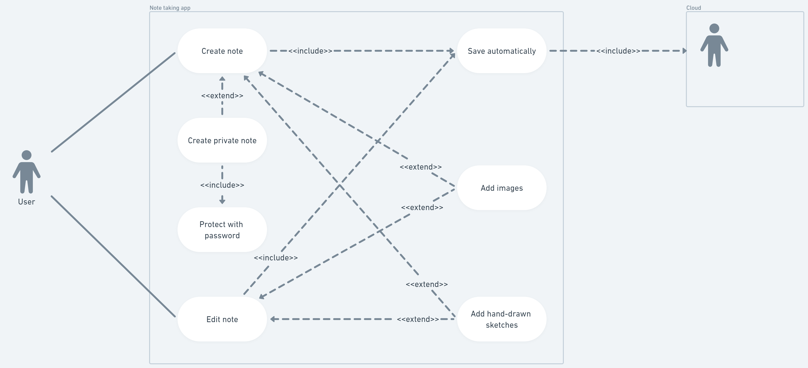
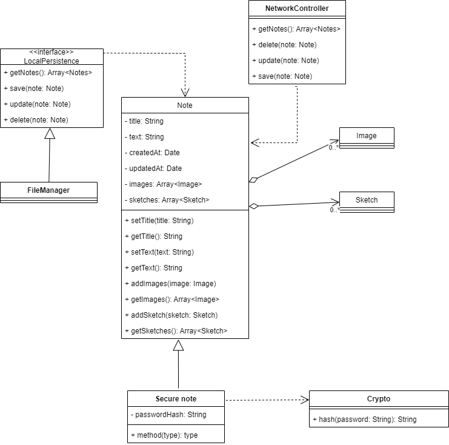

# Note Taking

## Functional requirements

1. Note creation and editing:
    - We need to build a note-taking app;
    - Users can create text-based notes;
    - Users can edit text-based notes;
    - A note may also include images;
    - A note may also include hand-drawn sketches.
2. Security/Password protection:
    - Sensitive notes can be protected using a password.
3. Syncing with the Cloud:
    - The app automatically uploads changes to cloud storage services (Dropbox, 
iCloud, and Google Drive).

## Nonfunctional requirements

- The app should be easy to use;
- The app must run on the latest iOS;
- The app should handle a large number of notes;
- The app must be secure;
- Include a dedicated support email and website.

## Epics

### Note creation and editing

- As a user, I want to create text-base notes to capture my thoughts;
- As a user, I want to edit mmy notes so that I can refine them over time;
- As a user, I want to include images in my notes so I can consolidate my 
memories;
- As a user, I want to include hand-drawn sketches so I can support my thoughts.

### Security/Password protection

- As a user, I want to set a password to my sensitive notes so its privacy can 
be protected from unwanted parties.

### Syncing with the Cloud

- As a user, I want my notes to automatically upload to cloud servers, so I 
always have a backup of my information.

## Use cases

## Class diagram
